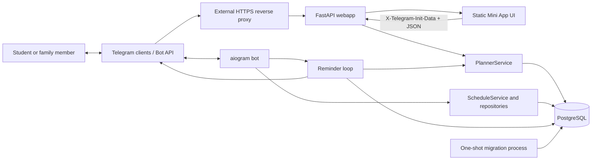

# Architecture

## Overview

School Planner is a containerized system with two long-running Python processes and one shared PostgreSQL database. The bot uses Telegram long polling and hosts the reminder loop. FastAPI serves the Mini App frontend and JSON API. A one-shot process applies SQL migrations before either application starts.

## System diagram

## Components

### Telegram bot

- **Location:** `app/main.py`, `app/telegram/`, `app/services/`, `app/repositories/`.
- **Inputs:** Telegram updates through long polling, environment configuration, and PostgreSQL data.
- **Outputs:** Telegram messages, keyboards, menu button, share flows, and health responses on `HEALTH_PORT`.
- **Dependencies:** Telegram Bot API and PostgreSQL.
- `MemoryStorage` holds transient FSM conversations. `ScheduleService` supports established commands and accesses canonical events through writable legacy views.

### FastAPI Mini App backend

- **Location:** `app/webapp/main.py`, `app/planner/api.py`, `app/planner/service.py`, `app/webapp/auth.py`.
- **Inputs:** HTTPS requests forwarded by the external proxy; Telegram init data in a header; JSON, multipart files, and route/query parameters.
- **Outputs:** JSON, ICS, authorized file downloads, health/readiness responses, and static frontend assets.
- **Dependencies:** PostgreSQL. Telegram is not called directly by request handlers.
- Each profile API request acquires one connection and transaction. `PlannerService` contains current calendar, authorization, import, task, membership, sharing, and bell logic.

### Frontend

- **Location:** `app/webapp/static/`.
- **Inputs:** bootstrap/profile API responses and Telegram WebApp runtime data.
- **Outputs:** API mutations and rendered DOM UI.
- `index.html` loads `planner-v2.css` and `planner-v2.js` with a release query. The root document is not cached; versioned assets are immutable. Legacy `styles.css`/`app.js` import the current assets for old cached HTML.
- The UI uses DOM construction rather than HTML injection. Only the theme is persisted in browser local storage.

### Database and migrations

- **Location:** `app/core/database.py`, `app/migrate.py`, `migrations/*.sql`.
- asyncpg pools have 1–10 connections per long-running process.
- `python -m app.migrate` obtains a PostgreSQL advisory transaction lock, creates `planner_migrations`, verifies checksums, and applies new SQL files transactionally.
- No ORM is used in current application code even though SQLAlchemy remains in declared dependencies.

### Reminder processing

- **Location:** `app/reminders.py`.
- An asyncio task inside the bot polls every `REMINDER_POLL_SECONDS`.
- It reads every reminder-enabled user's accessible profiles, resolves local dates with each user's timezone, and sends upcoming-event or evening-summary messages.
- `reminder_deliveries` is a durable idempotency ledger. A claim is inserted before Telegram send; duplicate claims are ignored.

### Backup and restore verification

- **Location:** `scripts/backup-postgres.sh`, `scripts/rehearse-postgres16.sh`, `deploy/systemd/`.
- The daily systemd timer invokes `pg_dump -Fc` against the resolved Compose database, validates the archive, records important table counts/non-secret metadata, and writes a SHA-256 checksum.
- An optional rsync destination provides off-host replication; `BACKUP_REQUIRE_REMOTE=1` turns a missing or failed remote copy into a failed job. An optional healthcheck URL reports success/failure.
- Restore rehearsal uses an isolated PostgreSQL 16 container backed by tmpfs, restores the dump, compares table counts, and verifies migration/profile functions without connecting application processes.

## Data flows

### Mini App startup and authenticated request

1. Telegram opens the configured HTTPS `WEBAPP_URL` and supplies signed init data to JavaScript.
2. The static app sends it in `X-Telegram-Init-Data`; credentials in query parameters are rejected.
3. `verify_init_data()` checks duplicate fields, HMAC-SHA256 using the bot token, user ID shape, future skew, and maximum age.
4. `/api/bootstrap` creates the database user/default profile if necessary and returns all accessible profiles and user settings.
5. Subsequent API calls recheck membership and the required role.

### Calendar resolution and mutation

1. Weekly and dated records are loaded from `planner_events`, with `event_exceptions` and `profile_holidays`.
2. `dated_entries()` resolves a requested date. Dated events remain active during holidays; regular events can be marked cancelled.
3. Same-type overlaps and configured daily limits are enforced. Cross-type overlap becomes a warning.
4. Writes lock the profile row and commit with the request transaction. Soft-deleted events can be restored after validation.

### Sharing/import

1. The author selects weekdays and event types.
2. The service stores a JSON snapshot in `planner_shares` and returns the clear token once; only its SHA-256 digest is persisted.
3. A recipient previews the snapshot and imports it into a writable profile.
4. Preview uses the normal import logic and rolls back; confirmed merge/replace commits atomically.
5. Tasks and files are never included in schedule snapshots.

### Reminder delivery

1. The bot's reminder loop resolves user-local time and events for every accessible profile.
2. When an event or evening summary enters its delivery window, it attempts to insert a unique delivery claim.
3. Only the claimant sends to Telegram, then updates the claim to `sent` or `failed`.
4. Claims are not replayed after failure or an uncertain send.

### Backup and restore rehearsal

1. The systemd timer starts a mutually exclusive backup job against the currently running database container.
2. The script produces dump, archive listing, counts, metadata, and checksum sidecars with mode 0600.
3. When configured, rsync copies the complete set to a different host before local retention is applied.
4. The rehearsal verifies the checksum and restores to temporary PostgreSQL 16, then compares canonical table counts and removes the container.

### Legacy compatibility

1. Existing bot handlers call `ScheduleService` and repositories against `schedule`/`extras`.
2. Migration `0002_planner.sql` renamed original tables to `legacy_schedule`/`legacy_extras` and created writable compatibility views.
3. INSTEAD OF triggers map legacy writes to the default profile in `planner_events`, using the same profile lock.
4. Read commands can resolve the selected default profile and dated calendar through the current service.

## APIs and protocols

- Current private API prefix: `/api`; generated OpenAPI is authoritative at `/openapi.json`, interactive docs at `/docs`.
- Main resource groups: bootstrap/user settings, profiles, day/week schedules, events/exceptions, copy-day, holidays, tasks/attachments, members/invites, shares/imports, bells, and ICS export.
- Compatibility endpoints in `app/webapp/main.py` expose `/api/schedule/day`, `/api/schedule/week`, and item CRUD for the original personal schedule model.
- Health: `/health` checks the web process, while `/healthz` and `/ready` also require the planner migration. The bot exposes a separate minimal HTTP health server.
- External protocols are HTTPS to the Mini App and Telegram Bot API long polling. There is no internal message queue or RPC layer.

## Storage

PostgreSQL is the only durable application store.

- `users`: Telegram user IDs, timezone, selected profile, and reminder preferences.
- `profiles`, `profile_members`: calendars and owner/editor/viewer membership.
- `planner_events`: recurring weekly templates and one-off dated events; soft deletion via `deleted_at`.
- `event_exceptions`, `profile_holidays`: occurrence replacements/cancellations and holiday ranges.
- `planner_tasks`, `task_attachments`: homework metadata and file bytes.
- `profile_invites`, `planner_shares`: hashed access tokens and schedule snapshots.
- `profile_bells`: optional bell slots.
- `reminder_deliveries`: notification claims/results.
- `legacy_schedule`, `legacy_extras`, `schedule`, `extras`, `share_tokens`: old data and compatibility surfaces.
- `planner_migrations`: applied migration names and checksums.

There is no application cache, object storage, or persistent filesystem upload directory.

## Authentication and authorization

- Telegram Mini App HMAC verification establishes user identity. Sessions are not server-side; age is checked on each signed launch payload.
- `WEBAPP_DEV_USER_ID` permits a local fallback identity only outside production.
- Profile membership is checked per request. Viewer can read; editor can mutate profile content; owner additionally manages profile metadata, invitations, and membership.
- Attachment reads and writes are joined to the requested profile to prevent cross-profile access.
- Share/import tokens grant snapshot lookup, but import still requires authentication and write access to the destination profile.
- Admin bot commands require membership in configured `ADMIN_IDS`.

## External systems

- Telegram is upstream for identity and bot transport.
- PostgreSQL is downstream for all durable state.
- The external HTTPS reverse proxy terminates TLS and forwards to Uvicorn. Its implementation is not present in this repository.

## Background processing

- One in-process asyncio reminder loop per bot process.
- aiogram long polling runs in the same process.
- No Celery, RQ, Kafka, Redis queue, cron job, or distributed scheduler exists.
- Production also runs `school-planner-backup.timer` under systemd; this is operational scheduling outside the application containers.
- Running multiple bot/reminder replicas is not the intended topology. Database claims prevent duplicate reminder rows, but Telegram polling and all other multi-replica behavior are not designed here.

## Infrastructure and runtime

Default `docker-compose.yml` defines:

- `db`: PostgreSQL 16 Alpine with an internal named volume and health check.
- `migrate`: one-shot application image, gated on database health.
- `bot`: long-running application image, gated on successful migrations.
- `webapp`: Uvicorn on container port 8000, normally published as loopback port 11002.

The shared application image runs as UID/GID 10001, drops Linux capabilities, enables `no-new-privileges`, uses Docker init, and rotates JSON logs.

Current production differs intentionally: it retains PostgreSQL 15 and the original bind-mounted `pgdata` under Compose project `school-planner-bot` through ignored `compose.keep-db.json`. The public Mini App currently reaches the webapp through an external proxy. See `PROJECT_MEMORY.md` and operator runbooks for the verified deployment state.

The backup timer is installed on the production VM. Local verified dumps are active; off-host rsync and external missing-run monitoring remain configuration work.

## Deployment architecture

1. Take and validate a PostgreSQL custom-format dump before risky upgrades.
2. Pull a fast-forward commit.
3. Use the production project name and both Compose files.
4. Build the application image and run `migrate` when migrations changed.
5. Recreate only `bot` and `webapp`; verify that the database container ID did not change.
6. Check readiness, logs, record counts, public assets, and user flows.

The current PostgreSQL 15 data directory must never be mounted into PostgreSQL 16. A version upgrade requires logical dump/restore into a new database and explicit cutover.

## CI/CD

`.github/workflows/check.yml` runs on push and pull request. It provisions disposable PostgreSQL 16, installs locked dependencies and Chromium, checks shell-script syntax, runs Ruff, migrations, pytest including Playwright, builds the Docker image, and uploads browser screenshots. Deployment is manual; there is no CD workflow.

## Configuration flow

`Settings` in `app/config.py` reads `.env` and process environment. Compose reads `.env`, supplies database/runtime values to all app services, and sets `AUTO_MIGRATE=false`; the dedicated migration service owns schema application. Static frontend configuration is returned by `/api/public-config` and contains only safe values such as bot username and development-mode status.

## Failure modes

- PostgreSQL unavailable: webapp startup/readiness and bot startup fail; no planner operations or reminders work.
- Pending or changed migration: `migrate` fails and Compose does not start dependent app services.
- Telegram unavailable: bot polling and sends fail; webapp data operations may continue, while reminders record failures.
- Expired or invalid init data: API returns 401 and the UI must be reopened through Telegram.
- Reverse proxy or TLS failure: public Mini App is unavailable while internal health may remain green.
- Old Telegram WebView cache: versioned assets, no-store HTML, and legacy asset shims provide recovery; future asset releases must maintain this strategy.
- Bot restart: in-progress FSM conversations disappear because state is memory-only.
- Disk or database growth: attachments are stored in PostgreSQL; no retention job exists.
- Backup destination unavailable: the job fails when `BACKUP_REQUIRE_REMOTE=1`; systemd records the failure and the optional healthcheck endpoint receives `/fail`.

## Current architecture vs planned architecture

No replacement architecture is approved. PostgreSQL 16 restore compatibility is rehearsed, but production cutover is pending. Potential changes tracked in `TODO.md` include off-host backup configuration, automated deployment, asset fingerprinting, and possible durable FSM/object storage.
