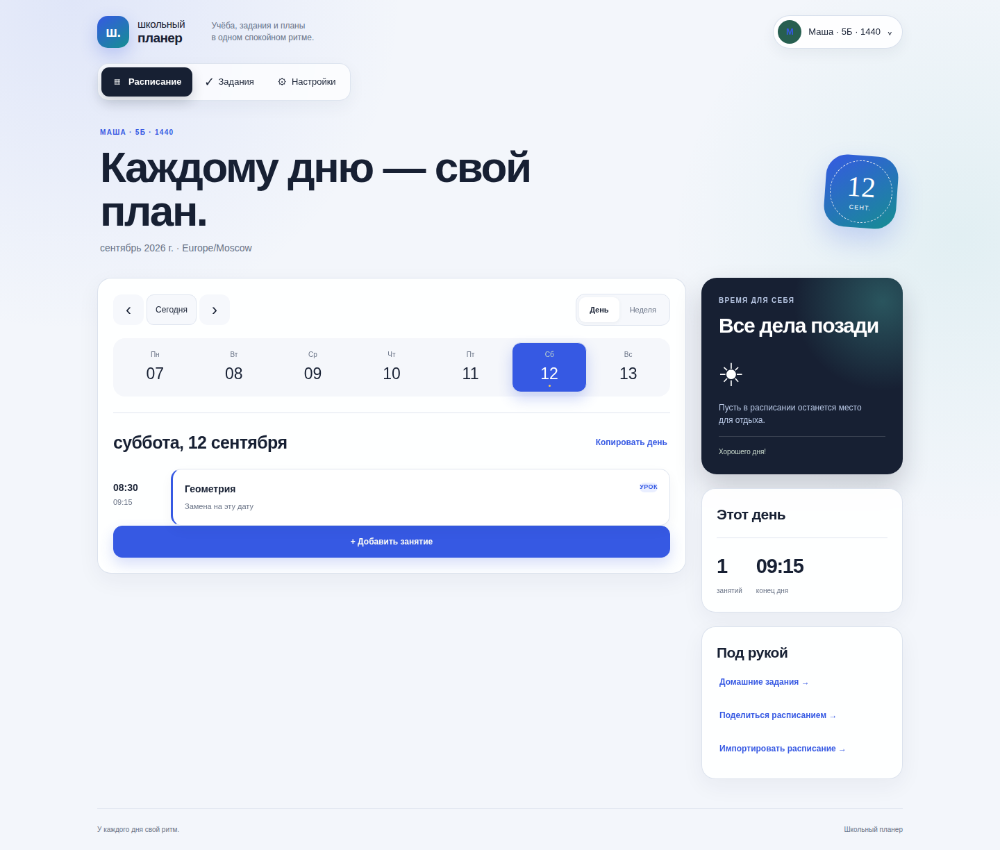

# Школьный планер

Telegram-бот и адаптивное мини-приложение для расписания, домашних заданий и совместного планирования в семье. Python 3.11+, FastAPI, aiogram, PostgreSQL 16; интерфейс на HTML/CSS/JavaScript без отдельной сборки Node.js.



## Что доступно

- День и неделя, переход к сегодняшнему дню, текущее и следующее занятие, мобильная навигация, светлая и тёмная темы.
- Повторяющиеся уроки и кружки, разовые занятия, замены и отмены на конкретную дату. Каникулы отменяют выбранные типы регулярных занятий; разовые остаются.
- Проверка времени и пересечений: внутри одного типа конфликт блокирует сохранение; пересечения урока и кружка показаны как предупреждение. Лимиты по умолчанию — 12 уроков и 6 кружков в день.
- Копирование дня с предварительным просмотром, объединение или замена; дублирование занятия и восстановление после удаления.
- Несколько профилей, приглашения редакторов и наблюдателей, отзыв доступа. До 20 собственных профилей.
- Домашние задания со сроками, предметом, описанием, отметкой выполнения и файлами. До пяти PDF, PNG, JPEG, WebP или TXT по 5 МБ на задание.
- Обмен снимком недельного расписания: выбор дней и типов, просмотр перед импортом, проверка конфликтов, отзыв ссылки. Ссылки и одноразовые приглашения действуют 7 дней.
- Настраиваемые звонки, экспорт календаря `.ics` на 28 дней от начала выбранной недели с учётом замен и каникул.
- Напоминания о занятиях и вечерняя сводка с заданиями на завтра. Включаются пользователем в настройках; часовой пояс общий для сайта и бота.
- Существующие команды бота сохранены. `/web` и кнопка меню открывают Mini App. `/today` и `/week` учитывают даты, каникулы и выбранный основной профиль.

[Архитектура и API](docs/architecture.md) · [Проверки и разработка](docs/development.md) · [Мобильный интерфейс](docs/planner-390.png)

## Запуск в Docker

```bash
cp .env.example .env
```

Заполните `BOT_TOKEN`, `BOT_USERNAME` (без `@`), `DATABASE_PASSWORD` и `WEBAPP_URL`. Последний должен быть публичным HTTPS-адресом приложения. Укажите этот домен в BotFather; обратный прокси должен направлять запросы на `127.0.0.1:11002`.

```bash
docker compose up -d --build
docker compose ps
docker compose logs --tail=100 migrate webapp bot
curl --fail http://127.0.0.1:11002/healthz
```

Compose запускает БД, отдельный процесс миграции, веб-приложение и бот. Миграция должна завершиться успешно до запуска приложения. PostgreSQL не публикует порт на хост; данные лежат в именованном томе `school-planner_postgres-data`. Контейнер приложения работает от непривилегированного пользователя.

В production вход возможен только через проверенные данные Telegram; `WEBAPP_DEV_USER_ID` в этом режиме запрещён. Обычная ссылка без авторизации показывает страницу запуска через бота. Сессия действует один час: после истечения приложение предложит открыть его заново.

### Пересборка после изменений

```bash
docker compose build
docker compose stop bot webapp
docker compose run --rm migrate
docker compose up -d bot webapp
```

Для изменений только HTML/CSS/JS миграция не требуется, достаточно `docker compose up -d --build webapp`. Зависимости контейнера зафиксированы в `requirements.lock`.

### Резервная копия

```bash
mkdir -p backups
docker compose exec -T db sh -c 'pg_dump -U "$POSTGRES_USER" -d "$POSTGRES_DB" -Fc' > backups/planner.dump
```

Резервные копии содержат расписания, задания и файлы. Храните их вне Git. Для восстановления в отдельную пустую БД:

```bash
docker compose stop bot webapp
docker compose exec -T db sh -c 'pg_restore -U "$POSTGRES_USER" -d "$POSTGRES_DB" --no-owner --exit-on-error' < backups/planner.dump
docker compose run --rm migrate
docker compose up -d bot webapp
```

### Обновление старой установки

Для обновления приложения **без смены версии и хранилища PostgreSQL** используйте [пошаговую инструкцию сохранения действующей БД](docs/safe-update.md).

Если новый Compose уже был запущен и рядом появились пустая PostgreSQL 16 и
старые работающие контейнеры, используйте
[инструкцию восстановления после перезаписи Compose](docs/rescue-old-containers.md).

Перед обновлением сделайте дамп работающей старой БД. Старая конфигурация использовала PostgreSQL 15 и могла хранить данные в `./pgdata`; новая использует PostgreSQL 16 и именованный том. Переносите данные через `pg_dump`/`pg_restore`, не подключайте каталог PostgreSQL 15 непосредственно к PostgreSQL 16. Не удаляйте старое хранилище до проверки восстановленной базы.

`0002_planner.sql` переносит уроки и кружки в `planner_events`, сохраняет оригиналы в `legacy_schedule` и `legacy_extras` и создаёт совместимые представления для команд бота. Существующие часовые пояса сохраняются; для новых пользователей используется `DEFAULT_TZ` (Москва по умолчанию). Старые ID записей могут измениться: перезагрузите открытые редакторы после обновления.

Миграции транзакционные и учитываются по имени и SHA-256. Повторный запуск безопасен, изменение уже применённого SQL блокируется. Если старые записи не соответствуют новым ограничениям длины (название 1–200, локация до 200, комментарий до 1000 символов), миграция откатится целиком. Исправьте такие записи в старой БД и повторите миграцию. Архивные таблицы после миграции не обновляются и не заменяют регулярные резервные копии.

## Важные особенности

- Старые текстовые команды редактирования и `/share` работают с личным исходным профилем. `/today` и `/week` читают профиль, выбранный в настройках. Для редактирования семейного профиля используйте Mini App.
- Старые ссылки `/share` действуют сутки и сохраняют прежний механизм импорта через подтверждение в боте; новые ссылки из Mini App содержат снимок и действуют 7 дней.
- Файлы скачиваются через авторизованный API и хранятся в PostgreSQL. Предпросмотра документов и антивирусного сканирования нет.
- Экспорт `.ics` — файл со снимком четырёх недель, а не постоянно обновляемая подписка.
- Напоминания проверяются каждые 30 секунд, отправляются по всем доступным профилям. После простоя пропущенные уведомления не рассылаются задним числом. Попытка отправки фиксируется до обращения к Telegram; при неопределённом результате повторной отправки нет, чтобы избежать дублей. Ошибки доступны в `reminder_deliveries` и логах. Для доставки пользователь должен сначала запустить бота.
- HTTPS, домен, рабочий токен Telegram и резервное копирование настраиваются при эксплуатации. В репозитории нет рабочих секретов.
