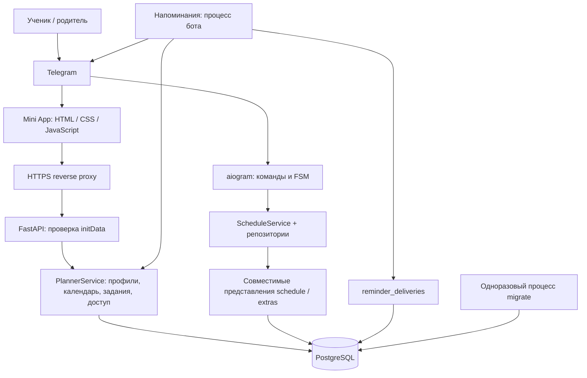

# Архитектура

## Данные и права

`users` содержит настройки пользователя. `profiles` хранит личные и дополнительные расписания; `profile_members` связывает их с владельцем, редакторами и наблюдателями. Личный профиль создаётся триггером при регистрации. `default_profile_id` выбирает профиль при открытии и для чтения команд `/today` и `/week`.

`planner_events` хранит недельные шаблоны и события на дату. `event_exceptions` — отмены и замены отдельных повторений, `profile_holidays` — интервалы каникул. Один алгоритм разрешения календаря используется в API, командах чтения бота, напоминаниях и экспорте. Отменённые события возвращаются интерфейсу, но исключаются из уведомлений и ICS.

`planner_tasks` и `task_attachments` хранят задания и файлы. Чтение и скачивание проверяют членство; изменения требуют роли редактора или владельца. Только владелец управляет участниками и параметрами профиля. Приглашения одноразовые, в базе хранится SHA-256 токена. Ссылки обмена содержат отдельный снимок недельного расписания без заданий и файлов.

Каждая операция нового API выполняется в транзакции. Изменения одного профиля сериализуются блокировкой строки профиля до проверки конфликтов и лимитов. Старые команды используют ту же блокировку и соединение через `ContextVar`. Предварительный импорт выполняет реальные проверки в savepoint с откатом. Ошибка любого шага не оставляет частично импортированный день.

Удаление занятия мягкое; восстановление заново проверяет конфликты. Удаление задания, вложения или дополнительного профиля окончательное. Права проверяются на каждом запросе; отозванный участник не может продолжить чтение через ранее открытый интерфейс.

## Основные API

Интерактивная схема находится в `/docs`, OpenAPI — `/openapi.json`. Во всех приватных запросах нужен заголовок `X-Telegram-Init-Data`; передача этих данных через URL отклоняется. Веб-приложение не записывает учётные данные в localStorage. Только тема хранится локально.

| URL | Возможности |
| --- | --- |
| `/api/bootstrap`, `/api/me` | Первичная загрузка, настройки |
| `/api/profiles` | Создание и список профилей |
| `/api/profiles/{pid}` | Название, цвет, удаление |
| `/api/profiles/{pid}/week?start=YYYY-MM-DD` | Семь разрешённых календарных дней |
| `/api/profiles/{pid}/schedule?date=YYYY-MM-DD` | Один день с отменами и предупреждениями |
| `/api/profiles/{pid}/events` | Создание занятия |
| `/api/profiles/{pid}/events/{eid}` | Чтение, замена, удаление |
| `/api/profiles/{pid}/events/{eid}/exceptions` | Отмена или замена повторения |
| `/api/profiles/{pid}/events/{eid}/restore` | Восстановление удалённого занятия |
| `/api/profiles/{pid}/copy-day` | Копирование и предварительная проверка |
| `/api/profiles/{pid}/holidays` | Каникулы |
| `/api/profiles/{pid}/tasks` | Задания |
| `/api/profiles/{pid}/tasks/{tid}/attachments` | Загрузка материалов |
| `/api/profiles/{pid}/attachments/{aid}` | Скачивание и удаление |
| `/api/profiles/{pid}/members`, `/invites` | Управление доступом |
| `/api/invites/{token}/join` | Принятие приглашения |
| `/api/profiles/{pid}/shares` | Создание и отзыв снимков |
| `/api/shares/{token}`, `/import` | Просмотр и импорт снимка |
| `/api/profiles/{pid}/bells` | Расписание звонков |
| `/api/profiles/{pid}/calendar.ics?start=YYYY-MM-DD` | Экспорт 28 дней |
| `/health`, `/ready`, `/healthz` | Жизнеспособность процесса и готовность БД |

Фронтенд отменяет устаревшие запросы при переходах между неделями и профилями, показывает ошибки загрузки с повтором, блокирует повторную отправку формы. Пользовательский текст создаётся DOM-методами без `innerHTML`. Размер входящего тела ограничен, включая запросы без `Content-Length`; скачивания имеют `Content-Disposition: attachment` и `nosniff`.
